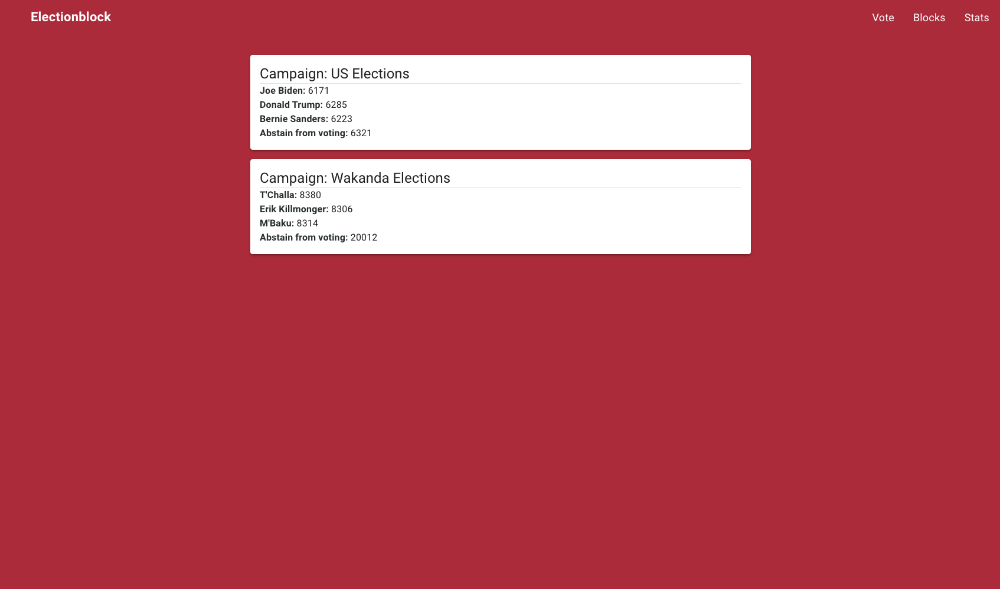

<div align="center">
<h1 align="center">Electionblock</h1>
</div>

<p align="center">

</p>

<p align="center">
  Mohamed Ibrahim, Kajan Ravindran, Hyon Lee, Omair Farooqui
</p>

### Introduction

ElectionBlock is a permissioned blockchain voting system, running on a centralized network of nodes, with the integration of a biometric scanner to allow for vote integrity and distinguish between registered and unregistered voters. This design allows for data immutability while providing the user with security and control over their ballot. Experimental results demonstrate the potential for scalability of the system to handle a high volume of votes from multiple servers while maintaining data integrity, performance, and security.


### Folder structure

```bash
.
├── README.md
├── app.py
├── block.py
├── blockchain.py
├── blockchainViewer.gif
├── client
├── constants.py
├── detect_finger.py
├── file_manager.py
├── fingerprint.gif
├── fingerprint_search.py
├── fingerprint_sensor.py
├── helpers.py
├── landing.png
├── locustfile.py
├── requirements.txt
├── run.sh
├── seed.py
├── shard.py
├── shard_broker.py
└── statistics.png
```

### Instructions to run

**Install dependencies**

```bash
pip3 install -r requirements.txt
```

**Run main blockchain server**

```bash
python3 app.py
```

If you want to run secondary nodes (slaves). Pass in a port number argument.
You can run as many nodes as you want.

```bash
python3 app.py <port number>
```

**Run client (React application)**

Change directory to client

```bash
cd client
```

Install node packages

```bash
npm install
```

Run client server

```bash
npm start
```

React app will run on http://localhost:3000

**Seed blockchain**

```bash
python3 seed.py
```

**Run fingerprint sensor**

In our example, we use a fpm10a fingerprint sensor with a model 4b raspberry pi. In order to run the application, you need to do the following.

1. ssh into raspberry pi

```bash
ssh pi@<ip address>
```

2. Change directory to server location

```bash
cd /var/www/electionblock_server
```

3. Start python virtual environment

```bash
. /venv/bin/activate
```

4. Run fingerprint server

```bash
python3 fingerprint_sensor.py
```

### Screenshots

<p align="center">

</p>

<p align="center">

</p>

<p align="center">

</p>

