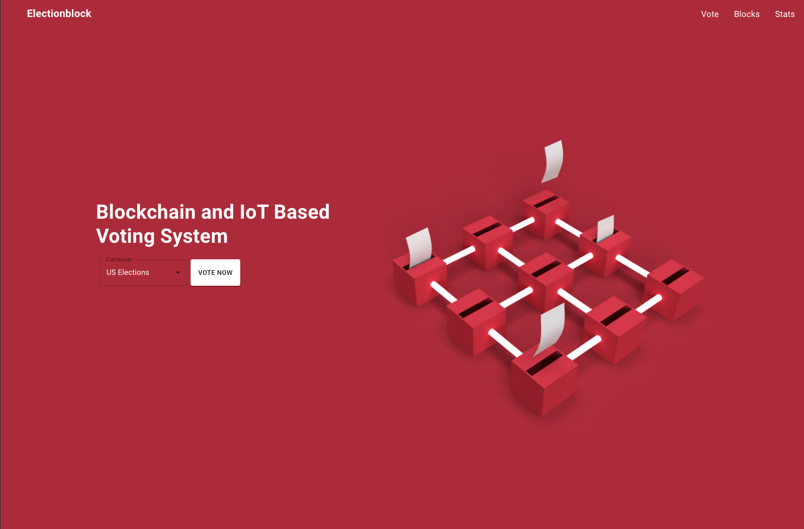

<div align="center">
<h1 align="center">Electionblock</h1>
</div>

<p align="center">

</p>


### Folder structure

```bash
.
├── app.py
├── broker.py
├── client
├── constants.py
├── detect_finger.py
├── fingerprint_search.py
├── fingerprint_sensor.py
├── helpers.py
├── merkle_blockchain.py
├── merkle_tree.py
├── requirements.txt
├── seed.py
└── serialize_blockchain.py
```

### Instructions to run

**Install dependencies**

```bash
pip3 install -r requirements.txt
```

**Run main blockchain server**

```bash
python3 app.py
```

If you want to run secondary nodes (slaves). Pass in a port number argument.
You can run as many nodes as you want.

```bash
python3 app.py <port number>
```

**Run client (React application)**

Change directory to client

```bash
cd client
```

Install node packages

```bash
npm install
```

Run client server

```bash
npm start
```

React app will run on http://localhost:3000

**Seed blockchain**

```bash
python3 seed.py
```

**Run fingerprint sensor**

In our example, we use a fpm10a fingerprint sensor with a model 4b raspberry pi. In order to run the application, you need to do the following.

1. ssh into raspberry pi

```bash
ssh pi@<ip address>
```

2. Change directory to server location

```bash
cd /var/www/votelink_server
```

3. Start python virtual environment

```bash
. /venv/bin/activate
```

4. Run fingerprint server

```bash
python3 fingerprint_sensor.py
```
